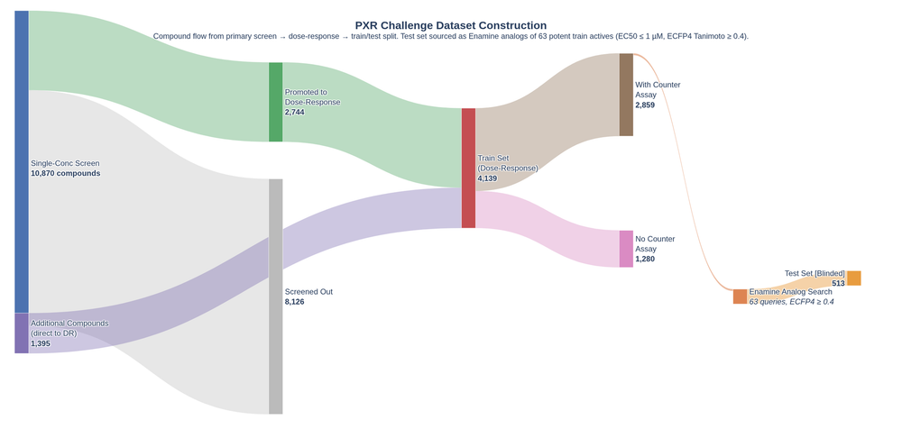

# OpenADMET PXR Challenge: How the Screening Data Was Generated

This document summarizes and expands the key experimental and dataset-design points described in the official OpenADMET blog post:

- Source: [Predicting PXR Induction - We have liftoff](https://openadmet.ghost.io/predicting-pxr-induction-we-have-liftoff/)
- Publisher: OpenADMET
- Publish date: April 1, 2026

The purpose of this note is to explain how the activity screening data were generated, why the dataset has the structure it does, and what those design choices imply for analysis and modeling.

## Why this background matters

The PXR challenge data are not a single uniform assay dump. They come from a multi-stage discovery workflow:

1. large-scale single-concentration screening
2. promotion of selected compounds into full dose-response testing
3. use of a counter-assay to identify false positives
4. later medicinal-chemistry-style analog expansion around potent compounds

This matters because the training and test sets were not created by random sampling from one homogeneous population. They reflect decisions made during an actual screening and follow-up campaign.

That means the dataset contains:

- a screening stage
- a confirmation stage
- a specificity stage
- a chemical-series expansion stage

Those stages create useful signal, but they also create selection effects that must be understood before building models.

## Biological basis of the primary assay

The main activity assay is a **cell-based reporter assay** designed to measure activation of the human pregnane X receptor, or PXR.

At a high level:

- cells are engineered so that luciferase expression is placed downstream of a PXR-responsive DNA binding site
- a compound is added to the cells at a given concentration
- if the compound activates or otherwise functionally engages PXR in the assay system, PXR drives luciferase expression
- after incubation, the cells are lysed and luciferase substrate is added
- the luminescence produced is measured

The amount of emitted light is treated as a readout of PXR-driven transcriptional activity.

### What the assay measures

This is important conceptually: the assay is not directly measuring physical binding to PXR. It is measuring a downstream functional consequence in a reporter system.

So the signal can be influenced by:

- true PXR activation
- broader transcriptional effects
- reporter-system interference
- cell-state or assay artifacts

That is why the counter-assay exists.

## Why the same assay supports both screening and dose-response work

According to the blog, the same primary assay format was used in two ways:

- **single-concentration screening**
- **8-point dose-response curves (DRCs)**

For the full DRC experiment, the response data are fit to the Hill equation to derive summary parameters such as:

- `EC50`
- `Emax`
- Hill slope

In challenge terms, the dose-response data are later represented as values such as `pEC50`, which is the negative log10 of the EC50 in molar units.

This gives the project two distinct data regimes:

- screening-level evidence from a small number of concentrations
- fitted potency and efficacy summaries from a full concentration series

That distinction is central to understanding the provided files.

## Role of the counter-assay

The counter-assay is described as being almost identical to the primary assay, except for one critical difference:

- the counter-assay cell line does **not** contain the PXR DNA binding site

Instead, luciferase is expressed from a different promoter that maintains a baseline signal independent of PXR binding.

### Why this matters

If a compound produces a signal in the primary assay but also produces a similar signal in the counter-assay, the signal is less likely to reflect true PXR-specific activity.

Instead, it may indicate:

- off-target transcriptional modulation
- reporter interference
- nonspecific assay interference

So a compound with high primary signal and high counter-assay signal is more likely to be a false positive for true PXR induction.

### Modeling implication

The blog explicitly says that participants are not evaluated directly on the counter-screen data, but are strongly encouraged to use it when building models for the primary assay.

That is a strong hint about intended use:

- the counter-assay should be treated as auxiliary information for specificity
- it is not the target itself, but it can improve target interpretation

## How single-concentration screening was used

The blog explains that **single-dose screening** was used to triage compounds from a larger Enamine collection.

The large screening collection contained roughly:

- 10,000 compounds from the Discovery Diversity 10 set
- about 1,000 compounds from the FDA Approved Drugs set

So the upstream screening pool was approximately **11,000 compounds**.

### Concentrations used in screening

The blog describes the single-concentration screen as using three discrete concentrations:

- about 10 uM
- 30 uM
- 100 uM

In the challenge dataset, the corresponding recorded values are approximately:

- `0.98 uM`
- `8.25 uM`
- `33 uM`
- `99 uM`

The challenge data include a slightly different low-concentration value than the blog’s simplified summary, but the overall idea remains the same: these were discrete screening concentrations, not a full continuous dose-response experiment.

### Why this is called “single-dose” or “single-concentration”

Although more than one concentration may appear in the screen, these points are not treated as a full fitted curve. They are used mainly to:

- estimate hit rates
- identify promising compounds
- understand an approximate working concentration range
- decide which compounds should be promoted to full dose-response profiling

In other words, the screening stage is primarily a **triage step**.

## Promotion from screening to full DRC

The blog explains that only a subset of the screened compounds moved on to full 8-point dose-response testing.

From the roughly 11,000 screened compounds:

- only a few thousand were active enough to be promoted to full DRC

Those promoted compounds were then measured in the more detailed 8-point format, and their EC50 values were estimated by curve fitting.

### Why this creates a selection effect

This means the DRC training data are not a random sample of the original 11,000 compounds. They are enriched for compounds that already looked interesting enough in the screen to justify follow-up.

That introduces an important bias:

- the dose-response dataset reflects both biology and triage decisions

So when working backward from the DRC file, it is easy to forget that the training labels come from a filtered subset of a much larger screening campaign.

## Construction of the challenge train and test sets

The blog explains that the challenge training and test sets were created from several related data sources collected under the same assay workflow and laboratory setup.

The stated goal was to provide as much training data as possible while maintaining a rigorous blind evaluation design.

### Training set

The training set contains:

- compounds from the screening-to-DRC workflow
- compounds from earlier direct-to-DRC experiments using other chemical matter
- other historical full-DRC PXR measurements collected in the same assay system

This means the training set is broad, but internally heterogeneous in how compounds entered the workflow.

### Test set

The test set was built differently.

The blog states that the organizers:

- identified **63 highly potent compounds** with `EC50 <= 1 uM` and confirmed on-target activity
- then ordered at least 10 chemically similar commercially available compounds around each potent seed
- ran those analogs as full DRCs
- used those chemically similar compounds to form the test set

The post also notes that after repeat measurements and refinement, the final number of highly potent compounds at that threshold became **46**, but that this did not change which chemisimilar compounds were used to build the test set.

### Why this matters for modeling

This is one of the most important dataset-design facts in the entire challenge.

The test set is not just “more compounds.” It is specifically enriched for **chemically similar analogs of potent compounds**.

That means strong performance requires more than broad global interpolation. It also requires the ability to model:

- local structure-activity relationships
- subtle potency differences within analog series
- extrapolation around known potent motifs

This also means leaderboard behavior may reward methods that are good at medicinal-chemistry-style analog ranking, not just coarse active/inactive separation.

## The Sankey-style assay flow described in the blog

The blog refers to a Sankey diagram representing the flow of compounds between screening and assay stages.

The key conceptual flow is:

1. some compounds entered directly into DRC testing early in the program
2. a much larger later set went through the single-concentration screen first
3. active-enough screening compounds were promoted to DRC
4. the most potent confirmed compounds seeded analog expansion
5. those analogs formed the blind test set

The blog also notes that the apparent flow from counter-assay to test set should not be interpreted as literal subsetting. Instead, it reflects a chemical-similarity relationship in the workflow explanation.

That is an important detail because it reminds us not to over-interpret the visualization as a strict row-by-row lineage map.

## Why the dataset is more complex than it first appears

The blog explicitly warns readers that “context is very important.”

That warning is justified because the dataset combines:

- different entry points into the assay flow
- a triage-based promotion process
- historical data from related experiments
- a test set constructed from analog expansion around potent compounds

So the challenge is not simply:

- “predict a label from a random sample of molecules”

It is closer to:

- “learn from a realistic staged discovery program and generalize into a chemically local, potency-focused blind analog set”

## Implications for the single-concentration file

The blog’s description strongly supports treating the single-concentration dataset as a real upstream screening layer rather than a lower-quality version of the DRC file.

That means the single-concentration data can be useful for:

- early hit identification
- coarse activity estimation
- identifying compounds with reproducible concentration-dependent signals
- deriving auxiliary features for later potency modeling

But it should not be mistaken for:

- a substitute for full DRC potency measurement

The screen helps decide **who gets promoted**, while the DRC data determine **how potent they are**.

## Implications for hit calling

The blog’s screening description supports a concentration-aware, triage-oriented hit-calling approach rather than a naive global threshold.

The logic is:

- the single-concentration stage exists to enrich for promising compounds
- hits should therefore be called in a way that balances statistical confidence and biological effect
- compounds active at multiple screening concentrations, especially below the highest concentration, should generally be prioritized above compounds active only at the top dose

This is consistent with the workflow implemented in the local hit-calling script:

- [`identify_single_concentration_hits.py`](/wsl$/Ubuntu/home/avranga1008/pxr-challenge/activity/scripts/identify_single_concentration_hits.py)

## Implications for train-test behavior

Because the test set is based on analogs around potent compounds, several modeling consequences follow.

### 1. Similarity matters

Methods that can exploit local chemical neighborhoods may perform well, especially if they recognize motifs associated with potent PXR induction.

### 2. Potency ranking matters

The final task is not only to identify actives. It is to predict `pEC50`, which means fine-grained ranking within active or near-active series matters.

### 3. Auxiliary data may help

The blog explicitly encourages using:

- single-concentration primary screen data
- `Emax`
- counter-assay results

This suggests the organizers expect performance gains from multi-view modeling rather than relying only on the final `pEC50` table.

## A practical interpretation of the whole workflow

The blog describes a screening campaign that can be understood as four connected steps.

### Step 1: Broad exploration

A large chemically diverse library was screened at a few discrete concentrations to quickly assess potential activity.

### Step 2: Focused confirmation

Only the more promising compounds were advanced to full 8-point dose-response testing so that potency and efficacy could be estimated more precisely.

### Step 3: Specificity filtering

A counter-assay was used to help distinguish true PXR-related activity from nonspecific reporter or transcriptional effects.

### Step 4: Analog expansion

Highly potent confirmed compounds were used as anchors for ordering and testing chemically similar analogs, creating a medicinal-chemistry-style blind test set.

This is why the challenge feels closer to real discovery work than to a simple benchmark dataset.

## Key takeaways

The most important points from the blog are:

- the primary assay is a luciferase-based cell reporter assay for PXR activity
- the counter-assay is a matched false-positive control without the PXR DNA binding site
- single-concentration screening was used as a triage stage on roughly 11,000 Enamine compounds
- only a subset of compounds progressed to full 8-point DRC testing
- the test set was built from analog expansion around highly potent confirmed compounds
- the train and test sets therefore reflect assay workflow and medicinal-chemistry decisions, not random sampling
- auxiliary datasets such as single-concentration screening and counter-assays are likely important for strong modeling performance

## Final modeling perspective

If this workflow is taken seriously, then a good modeling strategy should probably not treat the challenge as a single flat regression problem.

A more realistic view is:

- use the screening data to learn early activity patterns
- use the counter-assay to learn or filter nonspecific behavior
- use the DRC data to model potency among promoted compounds
- assume the final blind evaluation will stress analog-aware potency prediction

That is the key lesson from the official OpenADMET description of how the dataset was generated.
