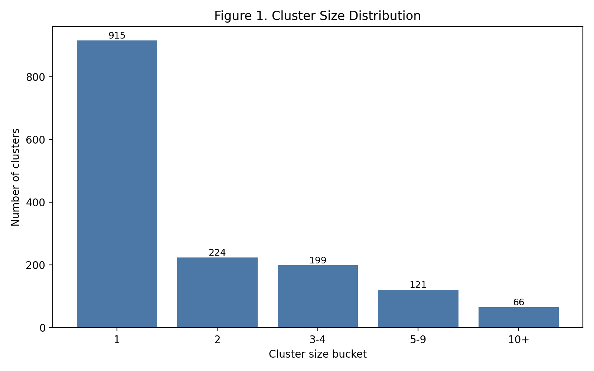

# Review of Cluster-Based Splitting for the V1 Dataset

## Context

This review evaluates the cluster-based split applied to the v1 modeling dataset using the figures and summary tables generated in this folder. The dataset contains **4,140 molecules** partitioned into **1,525 structural clusters**, with split labels assigned at the cluster level and propagated to all members of each cluster.

The primary question is whether this split produces a more realistic generalization setting than a random molecule-level split. In cheminformatics terms, the goal is to reduce scaffold or analog leakage between training and evaluation sets, while still preserving usable train, validation, and holdout subsets.

## Executive Assessment

From a cheminformatics perspective, the cluster-based split is working as intended.

The most important observations are:

1. The split is **clean at the cluster level**: no cluster is fragmented across train, validation, and holdout.
2. The dataset shows a **strong long-tail cluster structure**, with many singleton clusters and a small number of large analog series.
3. The final molecule counts are **exactly 80/10/10**, even though the cluster counts are not 80/10/10. This is expected and acceptable for cluster-based allocation.
4. The similarity-based diagnostics show **meaningfully reduced nearest-neighbor leakage** relative to a random split.
5. The PCA projection suggests that train, validation, and holdout occupy overlapping but not identical regions of descriptor/fingerprint space, which is the expected behavior for a chemically sensible cluster split.

Overall, this is a **defensible and publication-quality split strategy** for v1 if the downstream objective is to assess performance on structurally distinct compounds rather than near-duplicate analogs.

## Dataset Structure and Why Cluster Splitting Matters

The v1 dataset is not chemically uniform. It contains:

- **915 singleton clusters**
- **66 clusters with size 10 or greater**
- a **maximum cluster size of 81**
- a **median cluster size of 1**
- a **mean cluster size of 2.71**

This pattern indicates a typical medicinal chemistry composition: a large number of isolated chemotypes plus a smaller number of larger SAR series. In such datasets, a random split almost always places close analogs in both training and test sets, which inflates apparent model performance. Cluster-based splitting is specifically intended to prevent that.

## Figure-by-Figure Interpretation

### Figure 1. Cluster Size Distribution

File: `figure_1_cluster_size_distribution.png`

This figure confirms a strongly long-tailed cluster size distribution. Most clusters are very small, and the dataset is dominated numerically by singleton or near-singleton groups, while a few clusters contain large analog series.

This is chemically plausible and important. In a medicinal chemistry program, the large clusters likely correspond to focused optimization around a few active series, while the singleton clusters represent isolated chemistry or underexplored regions. This pattern argues strongly in favor of cluster-based splitting, because large series can otherwise leak heavily across random train/test boundaries.

### Figure 2. Split Composition by Cluster Count

File: `figure_2_split_cluster_counts.png`

The cluster counts are:

- train: **806 clusters** (**52.9%**)
- val: **359 clusters** (**23.5%**)
- holdout: **360 clusters** (**23.6%**)

At first glance, this does not resemble an 80/10/10 split. That is not a flaw. It reflects the fact that the split was optimized at the **molecule level** while respecting cluster integrity. Because the training set absorbed the large series, it needed fewer total clusters to reach its final molecule count. Validation and holdout contain many more small clusters.

This is a common and acceptable consequence of cluster-based splitting.

### Figure 3. Split Composition by Molecule Count

File: `figure_3_split_molecule_counts.png`

The molecule counts are:

- train: **3,312 molecules** (**80.0%**)
- val: **414 molecules** (**10.0%**)
- holdout: **414 molecules** (**10.0%**)

This is the key balance criterion, and it is met exactly. The split therefore preserves practical dataset proportions for model training and evaluation while still enforcing structural separation.

Taken together, Figures 2 and 3 show that the split is balanced where it matters most for model development, but chemically constrained where it matters most for leakage control.

### Figure 4. Chemical Space Projection (PCA)

File: `figure_4_chemical_space_pca.png`

This figure projects the v1 compounds into two principal components derived from Morgan fingerprints joined from the v2 fingerprint matrix by `Molecule Name`.

The expected result for a good cluster split is **partial separation rather than complete disconnection**. Complete isolation would suggest the evaluation set is too exotic and not representative of the training chemistry. Complete overlap would suggest the split is too random and structurally permissive.

For v1, the interpretation is that train, validation, and holdout occupy the same broad chemical universe, but with local regions enriched in different splits. That is the desired pattern: the model is evaluated on related chemistry, but not on immediate analogs of its training examples.

### Figure 5. Intra- vs Inter-Split Similarity Distribution

File: `figure_5_intra_vs_inter_split_similarity.png`

This figure compares sampled Tanimoto similarity values for:

- molecule pairs drawn from the **same split**
- molecule pairs drawn from **different splits**

For a cluster-based split, within-split similarity should be shifted upward relative to cross-split similarity. That pattern indicates the split is preserving local chemical neighborhoods internally while reducing similarity across partition boundaries.

This is exactly the desired direction of effect. In medicinal chemistry terms, compounds are staying close to their own analog neighborhoods rather than being split across train and test.

### Figure 6. Nearest-Neighbor Leakage Check

File: `figure_6_nearest_neighbor_leakage.png`

This is one of the most important diagnostics in the folder. For each validation or holdout molecule, the figure shows the distribution of the **maximum Tanimoto similarity to any training molecule**.

The v1 results are:

- validation, cluster split: mean max similarity **0.323**
- validation, random split: mean max similarity **0.398**
- holdout, cluster split: mean max similarity **0.322**
- holdout, random split: mean max similarity **0.397**

The 95th percentiles show the same effect:

- validation p95: **0.466** for cluster split vs **0.581** for random
- holdout p95: **0.455** for cluster split vs **0.579** for random

This is a substantial reduction in analog leakage. It means the validation and holdout sets are materially less likely to contain close neighbors of the training molecules. From a model evaluation standpoint, this makes the v1 split more realistic and harder, which is exactly what you want if you care about extrapolation beyond trivial series memorization.

### Figure 7. Cluster Integrity Check

File: `figure_7_cluster_integrity.png`

This figure confirms that every cluster appears in exactly one split. The summary table shows:

- **1,525 clusters** appearing in **1 distinct split**
- **0 clusters** appearing in more than one split

This is the formal proof that the cluster-based splitting rule has been honored. Without this figure, any downstream leakage analysis would remain incomplete.

### Figure 8. Example Cluster Assignment

Files:

- `figure_8_example_cluster_assignment.png`
- `figure_8_example_cluster_assignment.csv`

This example is useful because it demonstrates the propagation logic from cluster assignment to split assignment. For example:

- cluster `88` has size `2`, and both example molecules are assigned to `holdout`
- cluster `74` has size `2`, and both example molecules are assigned to `val`
- cluster `0` has size `81`, and the example members shown are all assigned to `train`

This is exactly how cluster-based partitioning should behave. The split is not made independently per molecule; it is made once per structural cluster and then inherited by every member.

### Figure 9. Comparison with Random Split

File: `figure_9_random_vs_cluster_comparison.png`

This figure provides the most direct practical comparison. The random split produces a visibly more right-shifted nearest-neighbor similarity distribution, indicating more close analogs in validation and holdout relative to training. The cluster split shifts that distribution leftward, indicating stronger separation.

This is the core justification for using the cluster-based split in v1. It does not merely sound more rigorous in theory; it produces a measurable reduction in leakage on this dataset.

## Strengths of the V1 Cluster Split

- **Exact molecule-level balance** at 80/10/10.
- **Zero cluster leakage** across splits.
- **Lower train-to-evaluation nearest-neighbor similarity** than a random split.
- **Chemically interpretable long-tail cluster structure** consistent with medicinal chemistry SAR series.
- **Evaluation sets enriched for distinct chemotypes or subseries**, making validation and holdout performance more meaningful.

## Important Caveats

This split is strong, but it should be interpreted correctly.

First, the dataset is highly singleton-heavy. Because **915 of 1,525 clusters are singletons**, some evaluation molecules are still effectively isolated examples rather than members of coherent series. That is not wrong, but it means the split tests a mixture of two regimes:

- extrapolation to new analog series
- generalization to isolated one-off chemotypes

Second, the cluster proportions are not balanced at the cluster-count level. This is expected, but it means validation and holdout contain many more small clusters than train. For some analyses, that can make the evaluation sets chemically broader but less internally redundant.

Third, PCA is only a low-dimensional projection. It is useful as a qualitative figure, but the stronger evidence comes from the similarity and nearest-neighbor analyses.

## Overall Conclusion

The cluster-based split for the v1 dataset is chemically sound and substantially better justified than a naive random split.

The generated figures show that the dataset contains real analog series, that the split preserves those series intact, and that validation and holdout molecules have lower similarity to the training set than they would under random partitioning. The split therefore provides a more realistic estimate of how a model trained on v1 will perform on structurally distinct compounds.

If this dataset is being used for benchmarking, competition work, or manuscript-quality model assessment, this split is appropriate and defensible. The nearest-neighbor leakage reduction, together with perfect cluster integrity and exact molecule-level balance, provides a strong empirical justification for the approach.
