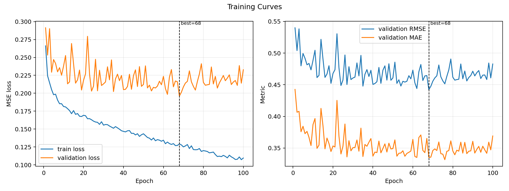
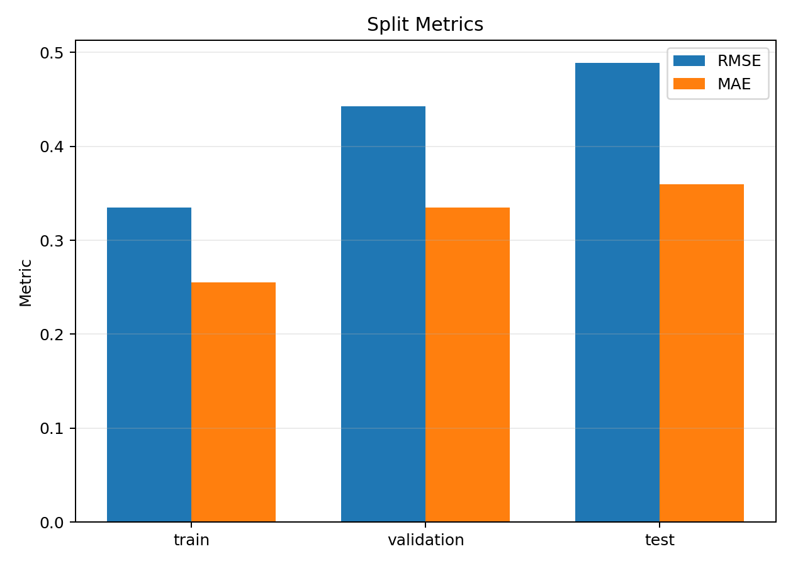
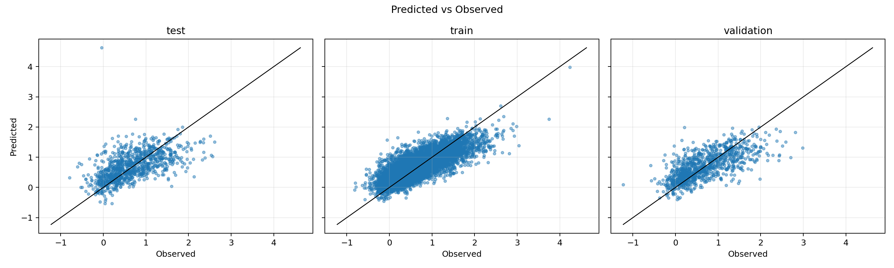
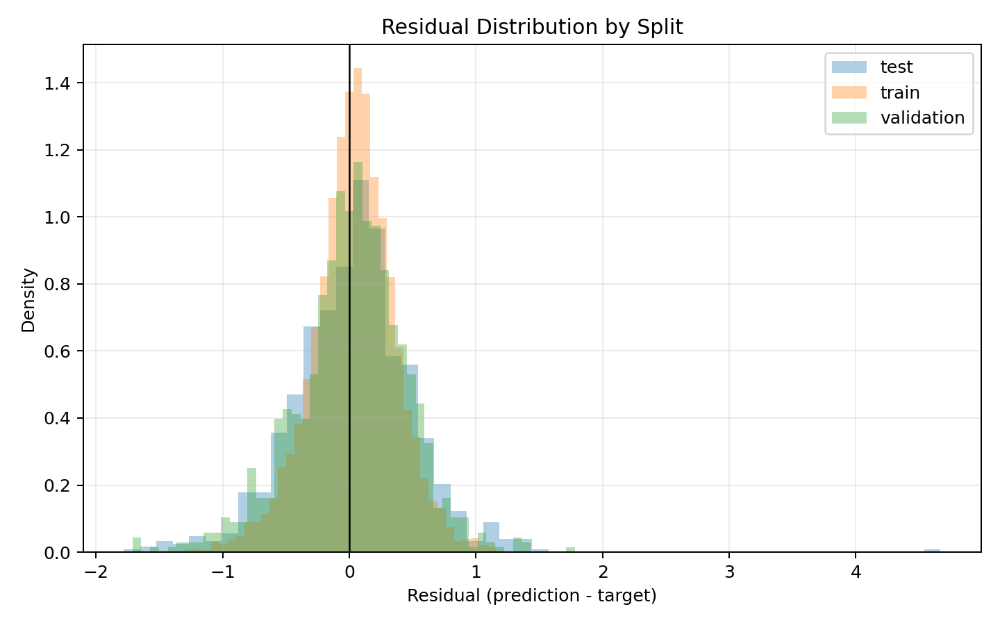
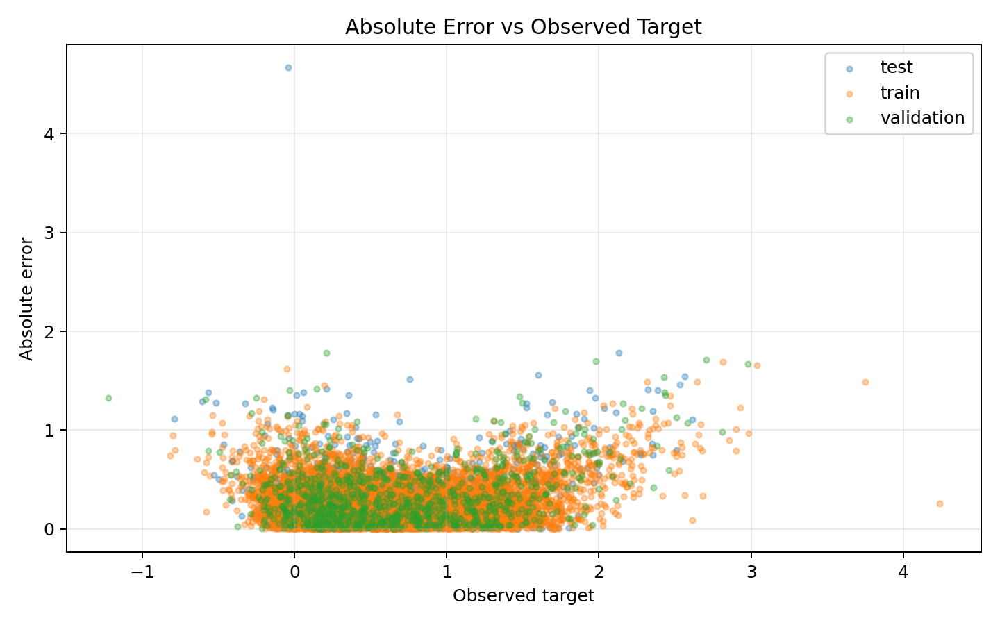
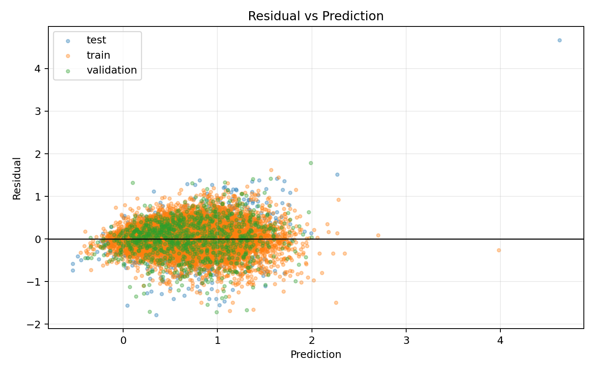
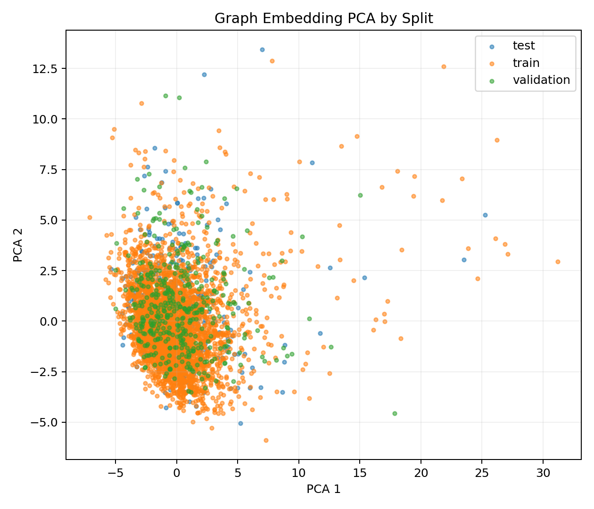
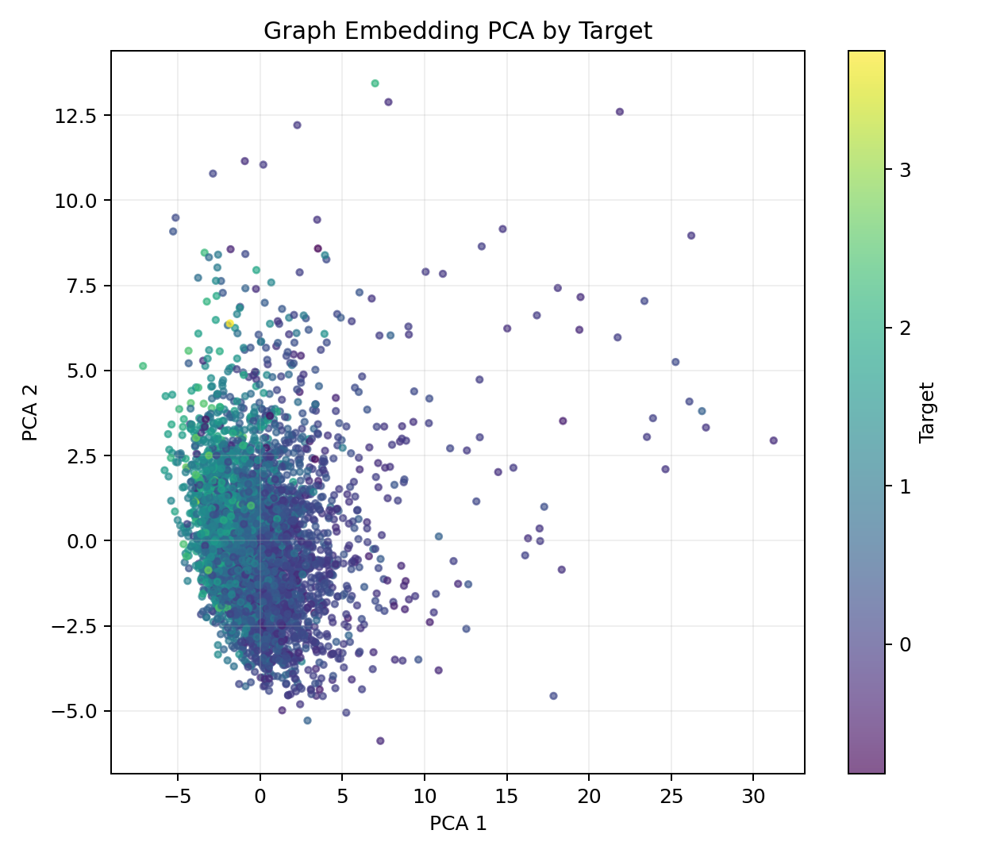

# Production Run Report: low_fidelity_33uM_gnn

## Executive Summary

The `low_fidelity_33uM_gnn` production run completed successfully for target `lf_signal_33uM`. Both training and export manifests are marked `run_mode=prod`, and the exported artifacts include a best checkpoint, predictions, graph embeddings, an embedding index, a final JSON report, and provenance manifests.

The model reached its best validation RMSE at epoch 68. Exported split metrics show validation RMSE 0.4423 and test/holdout RMSE 0.4887. The train-to-validation/test gap indicates some generalization loss, and validation metrics worsened after the best epoch, so this run should be communicated as a useful low-fidelity surrogate and embedding generator, not a final high-fidelity activity model.

## Run Identity

- Run directory: `activity/outputs/low_fidelity_33uM_gnn`
- Target: `lf_signal_33uM`
- Training manifest: `activity/outputs/low_fidelity_33uM_gnn/training_manifest.json`
- Export manifest: `activity/outputs/low_fidelity_33uM_gnn/export_manifest.json`
- Training command: `/home/avranga1008/pxr-challenge/pxr_gnn/src/pxr_gnn/pipelines/train_low_fidelity.py --config pxr_gnn/configs/low_fidelity_33uM.yaml --project-root /home/avranga1008/pxr-challenge --accelerator cuda --require-cuda --run-mode prod`
- Export command: `/home/avranga1008/pxr-challenge/pxr_gnn/src/pxr_gnn/pipelines/export_outputs.py --config pxr_gnn/configs/low_fidelity_33uM.yaml --project-root . --run-mode prod`
- Training run mode: `prod`
- Export run mode: `prod`

## Input Data And Filtering

- Input CSV: `/home/avranga1008/pxr-challenge/activity/data/features/single_dose_chemprop/chemprop_lf_regression_8_33_butina_split.csv`
- Input SHA256: `a1a312c68404d43aad8e7f3f509316ee098cbf38c2d021fc904b0ca1329938b9`
- Rows read: 10,835
- Rows dropped for missing `lf_signal_33uM`: 1,308
- Rows considered after target filtering: 9,527
- Valid molecular graphs: 9,527
- Invalid molecules: 0
- Split strategy: `column:split`

| Split | Graphs |
|---|---:|
| train | 7,601 |
| validation | 970 |
| test | 956 |

## Molecular Graph Featurization

The RDKit featurizer converts each SMILES string into graph arrays. Atom features have dimension 130 and bond features have dimension 14. Atom features include one-hot encodings for atomic number 1-100, total degree, formal charge, total hydrogens, and hybridization, followed by aromaticity, ring membership, and scaled atomic mass. Bond features include bond type, conjugation, ring membership, and stereochemistry. Unknown values are assigned to an extra one-hot bin.

Each undirected RDKit bond is represented as two directed edges. This gives `edge_index` shape `[2, directed_edges]` and `edge_attr` shape `[directed_edges, 14]`. For the first exported batch, the dataset had 128 graphs, 2940 nodes, and 6642 directed edges.

Implementation references:

- `pxr_gnn/src/pxr_gnn/data/featurization.py`: atom and bond feature construction.
- `pxr_gnn/src/pxr_gnn/data/dataset.py`: PyTorch Geometric `Data` object construction and split handling.

## GNN Architecture

The configured model is a graph-level GIN/GINE regressor:

- Encoder: `gin`
- Node feature dimension: 130
- Edge feature dimension: 14
- Hidden dimension: 256
- Message-passing layers: 3
- Readout: global mean pooling
- Dropout: 0.1
- Output: one scalar prediction per graph

The implementation projects atom features and bond features into the hidden space, applies three residual GINE message-passing blocks, pools graph-level representations, and predicts through a two-layer MLP head. Each message-passing block uses batch normalization, ReLU, dropout, and a residual connection. Exported graph embeddings are the pooled graph representations before the prediction head and have dimension 256.

Implementation reference:

- `pxr_gnn/src/pxr_gnn/models/gnn.py`

## Training Procedure

Training used AdamW with MSE loss:

- Device: `cuda`
- CUDA available during training: `True`
- Batch size: 128
- Max epochs: 100
- Learning rate: 0.0001
- Weight decay: 0.0
- Train batch limit: `None`
- Validation batch limit: `None`
- Best checkpoint criterion: validation RMSE

The best checkpoint was saved at epoch 68. Final epoch train loss was 0.1095, while final validation loss was 0.2328. The best validation RMSE was 0.4423; the final epoch validation RMSE was higher, so the report should emphasize that the exported predictions come from the best checkpoint, not simply the final epoch.

Implementation reference:

- `pxr_gnn/src/pxr_gnn/training/regression.py`

## Performance Results

| split | count | rmse | mae | r2 | pearson | spearman | mean_target | mean_prediction | mean_residual | residual_std |
| --- | --- | --- | --- | --- | --- | --- | --- | --- | --- | --- |
| train | 7601 | 0.3349 | 0.2555 | 0.6481 | 0.8079 | 0.8052 | 0.6310 | 0.6679 | 0.0369 | 0.3329 |
| validation | 970 | 0.4423 | 0.3352 | 0.4700 | 0.6892 | 0.7031 | 0.6836 | 0.7014 | 0.0178 | 0.4422 |
| test | 956 | 0.4887 | 0.3595 | 0.2774 | 0.5770 | 0.6385 | 0.6634 | 0.6945 | 0.0311 | 0.4880 |

## Residual Analysis

Residuals are defined as `prediction - target`. Mean residuals are positive but small on each split, indicating mild overprediction on average. The larger holdout RMSE relative to train RMSE should be treated as evidence of a real generalization gap.

| split | min | q05 | q25 | median | q75 | q95 | max |
| --- | --- | --- | --- | --- | --- | --- | --- |
| train | -1.6887 | -0.5320 | -0.1493 | 0.0484 | 0.2409 | 0.5582 | 1.6209 |
| validation | -1.7128 | -0.7613 | -0.2137 | 0.0380 | 0.2967 | 0.6531 | 1.7825 |
| test | -1.7805 | -0.7542 | -0.2542 | 0.0540 | 0.3019 | 0.7695 | 4.6691 |

Top-error examples are saved in `activity/outputs/low_fidelity_33uM_gnn/tables/top_absolute_errors.csv` for chemistry review.

## Embedding Analysis

The export step wrote 256-dimensional graph embeddings for all 9,527 graphs. PCA projections are provided as a quick diagnostic of representation space. These plots are descriptive, not a formal leakage or domain-shift test.

## Artifact Inventory

| artifact | path | exists | bytes | run_mode | artifact_warning |
| --- | --- | --- | --- | --- | --- |
| training_manifest | activity/outputs/low_fidelity_33uM_gnn/training_manifest.json | True | 3500 | prod | PRODUCTION RUN: artifacts were generated without smoke training limits. |
| export_manifest | activity/outputs/low_fidelity_33uM_gnn/export_manifest.json | True | 4420 | prod | PRODUCTION RUN: artifacts were generated without smoke training limits. |
| checkpoint | activity/outputs/low_fidelity_33uM_gnn/best_model.pt | True | 2810018 | prod | PRODUCTION RUN: artifacts were generated without smoke training limits. |
| training_summary | activity/outputs/low_fidelity_33uM_gnn/training_summary.json | True | 26331 | prod | PRODUCTION RUN: artifacts were generated without smoke training limits. |
| predictions | activity/outputs/low_fidelity_33uM_gnn/predictions.csv | True | 1071445 | prod | PRODUCTION RUN: artifacts were generated without smoke training limits. |
| graph_embeddings | activity/outputs/low_fidelity_33uM_gnn/graph_embeddings.npy | True | 9755776 | prod | PRODUCTION RUN: artifacts were generated without smoke training limits. |
| graph_embeddings_index | activity/outputs/low_fidelity_33uM_gnn/graph_embeddings_index.csv | True | 513099 | prod | PRODUCTION RUN: artifacts were generated without smoke training limits. |
| final_report | activity/outputs/low_fidelity_33uM_gnn/final_report.json | True | 1397 | prod | PRODUCTION RUN: artifacts were generated without smoke training limits. |
| featurization_summary | activity/outputs/low_fidelity_33uM_gnn/featurization_summary.json | True | 614 | prod | PRODUCTION RUN: artifacts were generated without smoke training limits. |
| graph_dataset_summary | activity/outputs/low_fidelity_33uM_gnn/graph_dataset_summary.json | True | 733 | prod | PRODUCTION RUN: artifacts were generated without smoke training limits. |

## Limitations

- This is a low-fidelity single-concentration surrogate for `lf_signal_33uM`, not the final high-fidelity `pEC50` model.
- The `8uM` paired production model should be completed before using both low-fidelity signals as downstream auxiliary features.
- The holdout/test split here is the project low-fidelity split, not the blinded challenge test set.
- Test RMSE is higher than validation RMSE, and both are higher than train RMSE.
- Export inference ran on CPU in this session, while production training ran on CUDA. The export manifest records `cuda_available=false`.
- This report does not compare against tabular baselines, Chemprop, XGBoost, or high-fidelity models.

## Recommended Next Steps

1. Complete the matching `low_fidelity_8uM_gnn` production training and export.
2. Generate a paired low-fidelity comparison report across 8uM and 33uM.
3. Join low-fidelity predictions and graph embeddings into the high-fidelity modeling matrix.
4. Compare these GNN-derived auxiliary features against existing tabular and fingerprint baselines.
5. Review the largest residual examples for chemistry or assay-pattern issues.
